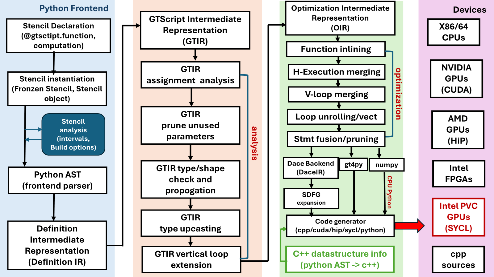
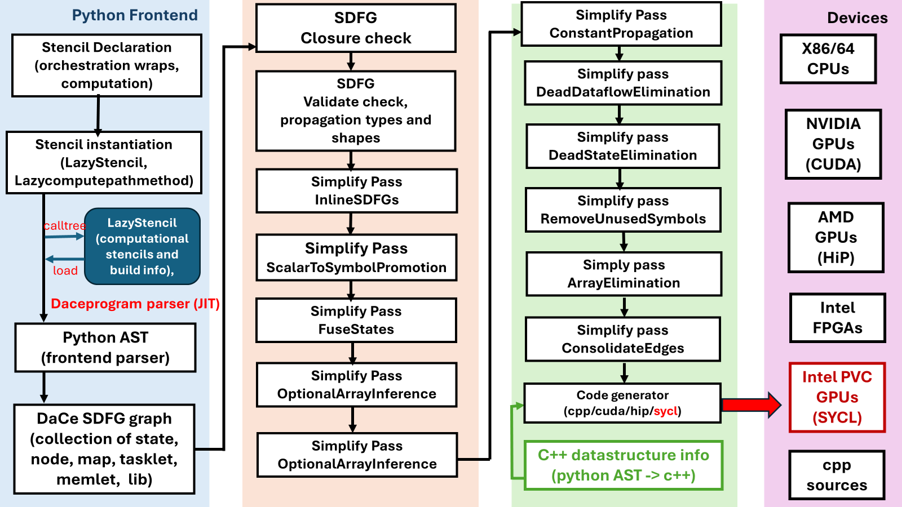

# Under the hood

This is the technical part of the documentation, geared towards developers contributing to NDSL.

## Introduction

Recently, Python has became the dominant programming language in the machine learning and data sciences communities since it is easy to learn and program. However, the performance of Python is still a major concern in scientific computing and HPC community. In the scientific computing and HPC community, the most widely used programming languages are C/C++ and Fortran, Python is often used as script language for pre- and post-processing.

The major performance issue in Python programming language, especially in computation-intensive applications, are loops, which are often the performance bottlenecks of an application in other programming languages too, such as C++ and Fortran. However, Python programs are often observed to be 10x to 100x slower than C, C++ and Fortran programs. In order to achieve peak hardware performance, the scientific computing communities have tried different programming models, such as OpenMP, Cilk+, and Thread Building Blocks (TBB), as well as Linux p-threads for multi/many-core processors and GPUs, Kokkos, RAJA, OpenMP offload, and OpenACC for highest performance on CPU/GPUs heterogeneous system. All of these programming models are only available for C, C++ and Fortran. Only a few work that target to high performance for Python programming language.

The Python based NDSL programming model described in this developer’s guide provides an alternative solution to reach peak hardware performance with relatively little programming effort by using the stencil semantics. A stencil is similar to parallel for kernels that are used in Kokkos and RAJA, to update array elements according to a fixed access pattern. With the stencil semantics in mind, NDSL, for example, can be used to write matrix multiplication kernels that match the performance of cuBLAS/hipBLAS that many GPU programmers can’t do in Cuda/HiP using only about 30 lines of code. It greatly reduces the programmer’s effort, and NDSL has already been successfully used in the Pace global climate model, which achieves up to 4x speedup, more efficient than the original Fortran implementations.

## Programming model

The programming model of NDSL is composed of backend execution spaces, performance optimization pass and transformations, and memory spaces, memory layout. These abstraction semantics allow the formulation of generic algorithms and data structures which can then be mapped to different types of hardware architectures. Effectively, they allow for compile time transformation of algorithms to allow for adaptions of varying degrees of hardware parallelism as well as of the memory hierarchy. Figure 1 shows the high level architecture of NDSL (without orchestration option), From Fig. 1, it is shown that NDSL uses hierarchy levels intermediate representation (IR) to abstract the structure of computational program, which reduces the complexity of application code, and maintenance cost, while the code portability and scalability are increased. This method also avoids raising the information from lower level representations by means of static analysis, and memory leaking, where feasible, and performing optimizations at the high possible level of abstraction. The methods primarily leverages structural information readily available in the source code, it enables to apply the optimization, such as loop fusion, tiling and vectorization without the need for complicated analysis and heuristics.



In NDSL, the python frontend code takes the user defined stencils to python AST using builtin ast module. In an AST, each node is an object defined in python AST grammar class (for more details, please refer: https://docs.python.org/3/library/ast.html). the AST node visitor (the NDSL/external/gt4py/src/gt4py/cartesian/frontend/gtscript_frontend.py) IRMaker class traverses the AST of a python function decorated by @gtscript.function and/or stencil objects, the Python AST of the program is then lowing to the Definition IR. The definition IR is high level IR, and is composed of high level program, domain-specific information, and the structure of computational operations which are independent of low level hardware platform. The definition of high level IR allows transformation of the IRs without loosing the performance of numerical libraries. However, the high level IR doesn’t contains detailed information that required for performance on specific low level runtime hardware. Specifically, the definition IR only preserves the necessary information to lower operations to runtime platform hardware instructions implementing coarse-grained vector operations, or to numerical libraries — such as cuBLAS/hipBLAS and Intel MKL.

The definition IR is then transformed to GTIR (gt4py/src/gt4py/cartesian/frontend/defir_to_gtir.py), the GTIR stencils is defined as in NDSL

```python
class Stencil(LocNode, eve.ValidatedSymbolTableTrait):
    name: str
    api_signature: List[Argument]
    params: List[Decl]
    vertical_loops: List[VerticalLoop]
    externals: Dict[str, Literal]
    sources: Dict[str, str]
    docstring: str

    @property
    def param_names(self) -> List[str]:
        return [p.name for p in self.params]

    _validate_lvalue_dims = common.validate_lvalue_dims(VerticalLoop, FieldDecl)
```

GTIR is also a high level IR, it contains vertical_loops loop statement, in the climate applications, the vertical loops usually need special treatment as the numerical unstanbility is a reason. The vertical_loops in GTIR as separate code block and help the following performance pass and transformation implementation. The program analysis pass/transformation is applied on the GTIR to remove the redundant nodes, and pruning the unused parameters, and data type and shape propagations of the symbols, and loop extensions.

The GTIR is then further lowered to optimization IR (OIR), which is defined as

```python
class Stencil(LocNode, eve.ValidatedSymbolTableTrait):
    name: str
    # TODO: fix to be List[Union[ScalarDecl, FieldDecl]]
    params: List[Decl]
    vertical_loops: List[VerticalLoop]
    declarations: List[Temporary]

    _validate_dtype_is_set = common.validate_dtype_is_set()
    _validate_lvalue_dims = common.validate_lvalue_dims(VerticalLoop, FieldDecl)
```

The OIR is particularly designed for performance optimization, the performance optimization algorithm are carried out on OIR by developing pass/transformations. Currently, the vertical loop merging, and horizontal execution loop merging, and loop unrolling and vectorization, statement fusion and pruning optimizations are available and activated by the environmental variable in the oir_pipeline module.

After the optimization pipeline finished, the OIR is then converted to different backend IR, for example, DACE IR (SDFG). The DACE SDFG can be further optimized by its embedded pass/transformations algorithm, but in PACE application, we didn’t activate this optimization step. It should be pointed out that, during the OIR to SDFG process, the horizontal execution node is serialized to SDFG library node, within which the loop expansion information is encrypted.

When using GT backend, the OIR is then directly used by the gt4py code generator to generate the C++ GridTools stencils (computation code), and the python binding code. In this backend, each horizontal execution node will be passed to and generate a separate GridTools stencil.

NDSL also supports the whole program optimization model, this is called orchestration model in NDSL, currently it only supports DaCe backend. Whole program optimization with DaCe is the process of turning all Python and GT4Py code in generated C++. Only _orchestrate_ the runtime code of the model is applied, e.g. everything in the __call__ method of the module and all code in __init__ is executed like a normal GT backend.

At the highest level in Pace, to turn on orchestration you need to flip the FV3_DACEMODE to an orchestrated options _and_ run a dace:* backend (it will error out if run anything else). Option for FV3_DACEMODE are:

- _Python_: default, turns orchestration off.
- _Build_: build the SDFG then exit without running. See Build for limitation of build strategy.
- _BuildAndRun_: as above, but distribute the build and run.
- _Run_: tries to execute, errors out if the cache don’t exists.

Code is orchestrated two ways:

- functions are orchestrated via orchestrate_function decorator,
- methods are orchestrate via the orchestrate function (e.g. pace.driver.Driver._critical_path_step_all)

The later is the way we orchestrate in our model. orchestrate is often called as the first function in the __init__. It patches _in place_ the methods and replace them with a wrapper that will deal with turning it all into executable SDFG when call time comes.

The orchestration has two parameters: config (will expand later) and dace_compiletime_args.

DaCe needs to be described all memory so it can interface it in the C code that will be executed. Some memory is automatically parsed (e.g. numpy, cupy, scalars) and others need description. In our case Quantity and others need to be flag as dace.compiletime which tells DaCe to not try to AOT the memory and wait for JIT time. The dace_compiletime_args helps with tagging those without having to change the type hint.

Figure 2 shows the hierarchy levels of intermediate representations (IR) and the lowing process when orchestration option is activated.



When the orchestrated option is turned on, the call method object is patched in place, replacing the original Callable with a wrapper that will trigger orchestration at call time. If the model configuration doesn’t demand orchestration, this won’t do anything. The orchestrated call methods and the computational stencils (lazy computational stencils) which are cached in a container, will be parsed to python AST by the frontend code during the runtime, then the python AST code will be converted to DaCe SDFG. The analysis and optimization will be applied before the C++ code is generated by the codegen, this process is called Just In Time (JIT) build, compared with the non-orchestration model, which is eagerly compiled and build. The JIT build caches the build information of computational stencils, and orchestrated methods, and it is more convenient to apply the analysis and optimization pass to the overall code, such as the merging of neighbor stencils made easy. Therefore, more optimized code can be generated, and better performance can be achieved during runtime.

## Analysis and Optimization

One of the major features of NDSL is that users can develop a new pass/transformation for the backend with new hardware, the passes and/or transformations are the key integrates in order to have good performance on the new hardware. In different abstract level, the passes and/or transformations perform different levels of optimization. For example, the loop level of optimization is independent of hardware, and can be applied to any backend, while the optimization of device placement, and memory and caches optimizations are dependent on different backend and hardware. In this section, we only focused on the optimizations that are independent of the backend hardware.

The general procedure of code optimization has two steps, in the first step, a filter function is called to find the pattern that need to apply the pass and/or transformation, then apply the pass and/or transformation to the filtered pattern to insert or delete or replace the existing node with the optimized node. In NDSL, the following passes and/transformations are provided.

```python
def prune_unused_parameters(node: gtir.Stencil) -> gtir.Stencil:
      assert isinstance(node, gtir.Stencil)
      used_variables = (
        node.walk_values()
        .if_isinstance(gtir.FieldAccess, gtir.ScalarAccess)
        .getattr("name")
        .to_list()
      )
      used_params = list(filter(lambda param: param.name in used_variables, node.params))
      return node.copy(update={"params": used_params})
```

## Code generators
