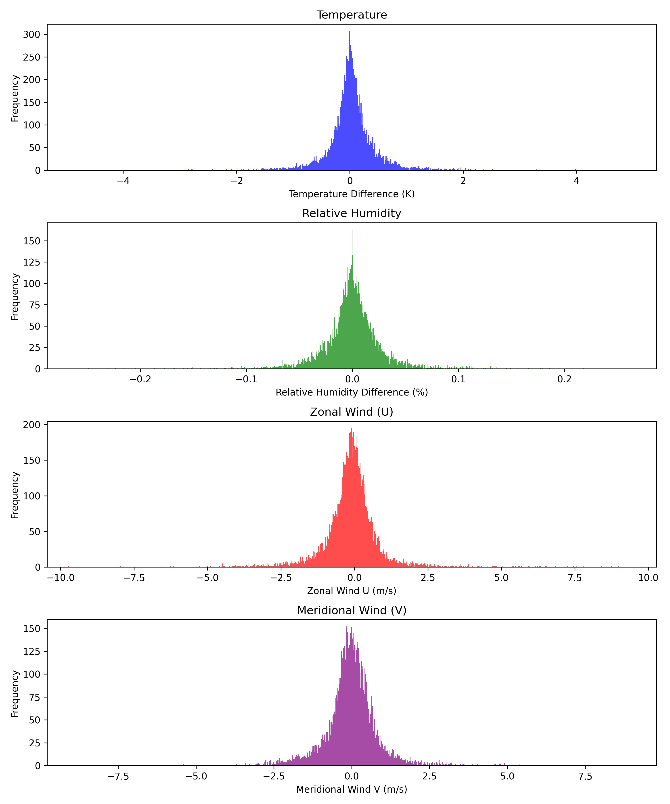

# GF2020 Deep Convection

!!! abstract ""
    [Back to GEOS-FP results summary](summary.md)

This page showcases results from the NDSL port of GF2020 Deep Convection Scheme (GF2020). The work was concluded in June 2026 with validation on performance backends and early pre-optimization benchmarks.

## Validation

Validation was performed by comparing NDSL simulations against the reference Fortran implementation using 7-day GEOS-FP integrations at C180, C360, and C720 horizontal resolutions. For this analysis, only the GF2020 deep convection scheme was replaced with its NDSL implementation, while all other model components remained in their original Fortran form.

### Histograms of Diagnostic Variables

Histograms of differences between the Fortran and NDSL simulations for temperature, relative humidity, zonal wind, and meridional wind after 7 days. The distributions are centered near zero, indicating strong agreement between the two model implementations.

=== "C48 CPU"
    

=== "C48 GPU"
    

### Spatial Distribution of Diagnostic Variables

The figures below compare Fortran vs NDSL after 7 days of integration. The largest differences are concentrated in regions of active weather, particularly near frontal systems and convective activity. In these areas, small shifts in the position or timing of weather features can produce locally large point-by-point differences, even when the overall meteorological structures remain very similar.

=== "C48 T"
    

=== "C48 QV"
    

=== "C48 U"
    

=== "C48 V"
    

## Benchmarking

Performance was evaluated by measuring the wall-clock execution time of the GFDL1M microphysics scheme at the Fortran interface level. For GPU runs, timings were recorded after device synchronization to ensure that all GPU work was completed before measurement. As a result, the reported times include the overhead associated with data movement and execution between the CPU and GPU.

Execution times are reported in seconds. Speedup is calculated relative to the reference Fortran:

- **Positive speedup** indicates that NDSL executes faster than the reference Fortran.
- **Negative speedup** indicates that NDSL executes slower than the reference Fortran.

| Resolution   | Layout | Fortran | NDSL GPU (st:dace:gpu) | NDSL CPU (st:dace:cpu:KJI) | Speedup (Fortran/GPU) | Speedup (Fortran/CPU) |
|-------------|--------|---------|------------------------|----------------------------|----------------------|----------------------|
| C180 (~51 km) | 4×4 | 0.23 s | 0.04 s | 0.37 s | 6.29× | -1.62× |
| C360 (~xx km) | ?×? | x.xx s | x.xx s | x.xx s | x.xx× | -x.xx× |
| C720 (~xx km) | ?×? | x.xx s | x.xx s | x.xx s | x.xx× | -x.xx× |
