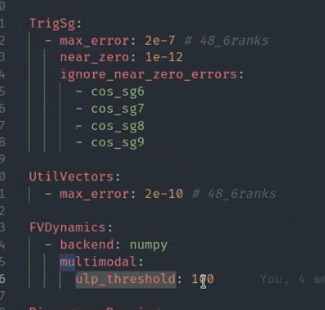
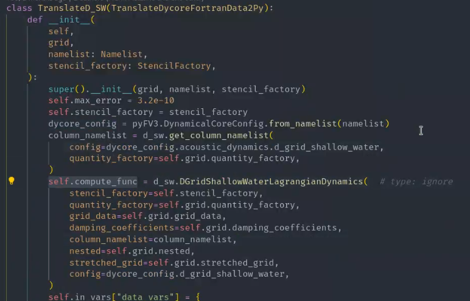
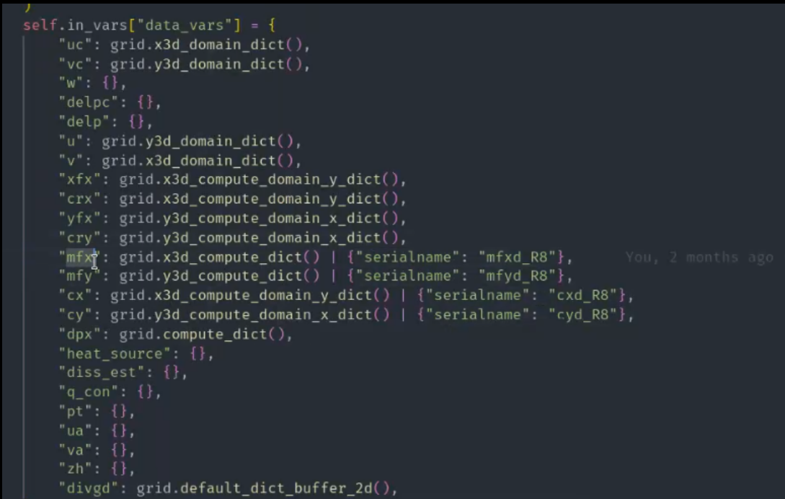
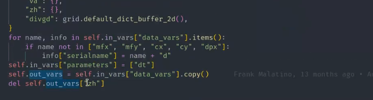
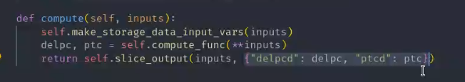

# Translate tests

We call tests that validate subsets of computation against serialized data "translate tests". These should provide a baseline with which we can validate ported code and ensure the pipeline generates expected results.

## The Translate infrastructure

The infrastructure is set up in a way that for basic cases, all the default implementations are enough:

The `TranslateFortranData2Py` base class will be evaluated through the function `test_sequential_savepoint`.
The general structure is:

1. Extract tolerances for errors - either the defaults or the overwritten ones:
    - Maximal absolute error
    - Maximal relative error
    - Allowed ULP difference
2. Extract input data from `{savepoint_name}-In.nc`
3. Run the `compute` function, returning the outputs.
4. Extract reference output data from `{savepoint_name}-Out.nc`
5. Compare the data in `out_vars` to the reference data.

For these steps to work, the name of the translate test needs to match the name of the data.
In case of special handling required, almost everything can be overwritten:

### Overwriting thresholds

You can create an overwrite file to manually set the threshold in you data directory:

### Overwriting Arguments to your compute function

The compute_func will be called automatically in the test. If your names in the netcdf are matching the `kwargs` of your function directly, no further action required:

If you need to rename it from the netcdf, you can use ["serialname"]:

The same applies for scalar inputs with parameters:

### Modifying output variables

This can be required either if not all output is serialized, the naming is different or we need the same data as the input:

### Modifying the `compute` function

Normally, compute has the three steps:

1. setup input
2. call `compute_func`
3. slice outputs

Slight adaptations to every step are possible:

